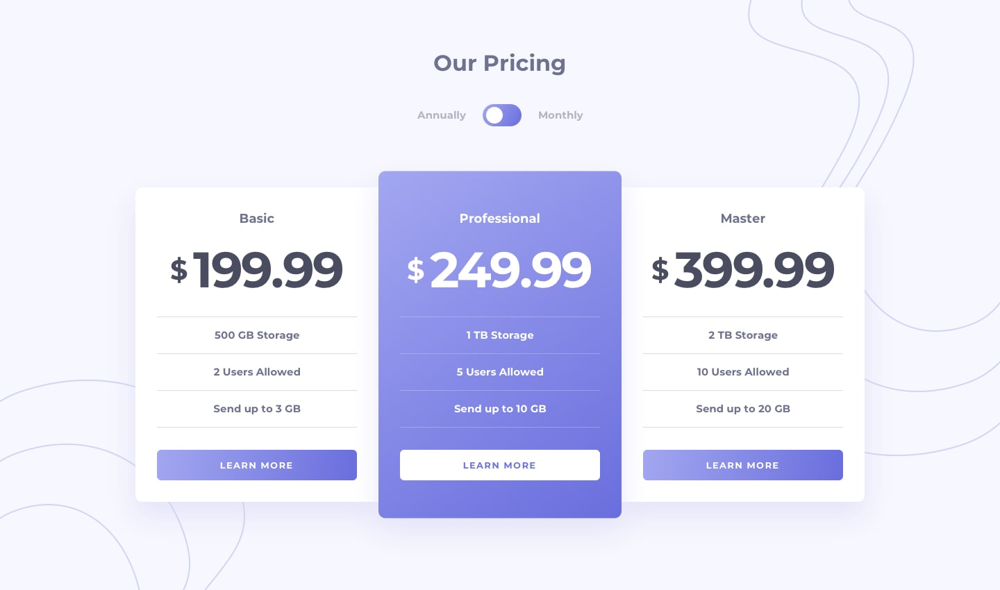

# Frontend Mentor - Pricing component with toggle solution

This is a solution to the [Pricing component with toggle challenge on Frontend Mentor](https://www.frontendmentor.io/challenges/pricing-component-with-toggle-8vPwRMIC). Frontend Mentor challenges help you improve your coding skills by building realistic projects. 

## Table of contents

- [Overview](#overview)
  - [The challenge](#the-challenge)
  - [Screenshot](#screenshot)
  - [Links](#links)
- [My process](#my-process)
  - [Built with](#built-with)
  - [What I learned](#what-i-learned)
  - [Continued development](#continued-development)
  - [Useful resources](#useful-resources)
- [Author](#author)

## Overview

### The challenge

Users should be able to:

- View the optimal layout for the component depending on their device's screen size
- Control the toggle with both their mouse/trackpad and their keyboard
- **Bonus**: Complete the challenge with just HTML and CSS

### Screenshot



### Links

- Live Site URL: [Add live site URL here](https://your-live-site-url.com)

## My process

### Built with

- Semantic HTML5 markup
- CSS custom properties
- Flexbox
- Javascript

### What I learned

Use this section to recap over some of your major learnings while working through this project. Writing these out and providing code samples of areas you want to highlight is a great way to reinforce your own knowledge.

```js
let switches = document.querySelectorAll('.ios-switch');
let priceYearly = document.querySelectorAll('.price-yearly');
let priceMonthly = document.querySelectorAll('.price-monthly');

for (var i = 0; i < switches.length; i++) {
  switches[i].addEventListener('click', function(event) {
    if (this.classList.contains('active')) {
      priceYearly.forEach(x => x.classList.toggle('active'));
      priceMonthly.forEach(x => x.classList.toggle('active'));
      this.classList.remove('active');
    } else {
      priceYearly.forEach(x => x.classList.toggle('active'));
      priceMonthly.forEach(x => x.classList.toggle('active'));
      this.classList.add('active');
    }
  })
}
```

### Continued development

Achieving effects with more complicated javascript.

### Useful resources

- [iOS style switch - DevMarketer](https://youtu.be/KJKcup31kw0) - Great tutorial. Helped me build the toggle for this project.

## Author

- Instagram - [@sophiestrausberg](https://instagram.com/sophiestrausberg)
- Frontend Mentor - [@sophiestrausberg](https://www.frontendmentor.io/profile/sophiestrausberg)
